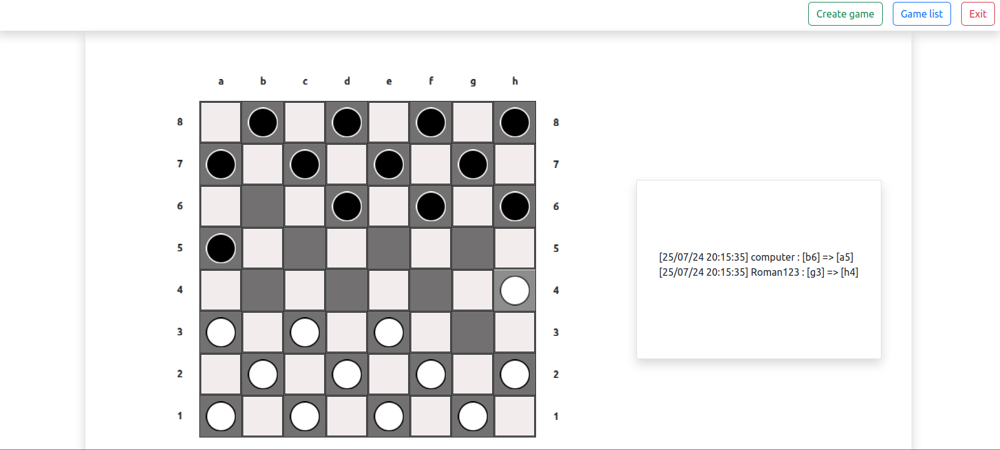

## Table of contents

* [General info](#general-info)
* [Tools](#tools)
* [Current features](#current-features)
    - [Current works](#current-works)
    - [ToDo](#todo)
* [Setup](#setup)
* [Test](#test)
* [Screenshot](#screenshots)

## General info

Game "Checkers"

Currently, it is under development.

## Tools

- Symfony v7.1.1
- PHP v8.2
- Mysql v8.0.33
- Bootstrap v5.2.2
- Mercure

## Current features

- Ability to play for two players
- Ability to play multiple games at the same time
- Ability to play with computer
- Logger
- Authorization through social networks
- Server-Sent-Events

## Current works

- Algorithm for game with computer

## ToDo

- Statistics

## Setup

Copy the .env.dist file and edit the entries to your needs:

```
cp .env.example .env
```

Start docker-compose to start your environment:

```
docker-compose up
```

Install Packages

```
docker exec php composer install
```

Migrate migrations

```
docker exec php ./vendor/bin/doctrine-migrations migrations:migrate
```

## Test

Copy the phpunit.xml file and edit the entries to your needs:

```
cp phpunit.xml.dist phpunit.xml
```


Create schemas for testing

```
docker exec php bin/console --env=test doctrine:schema:create
```

Run tests

```
docker exec php bin/phpunit
```
## Screenshots


